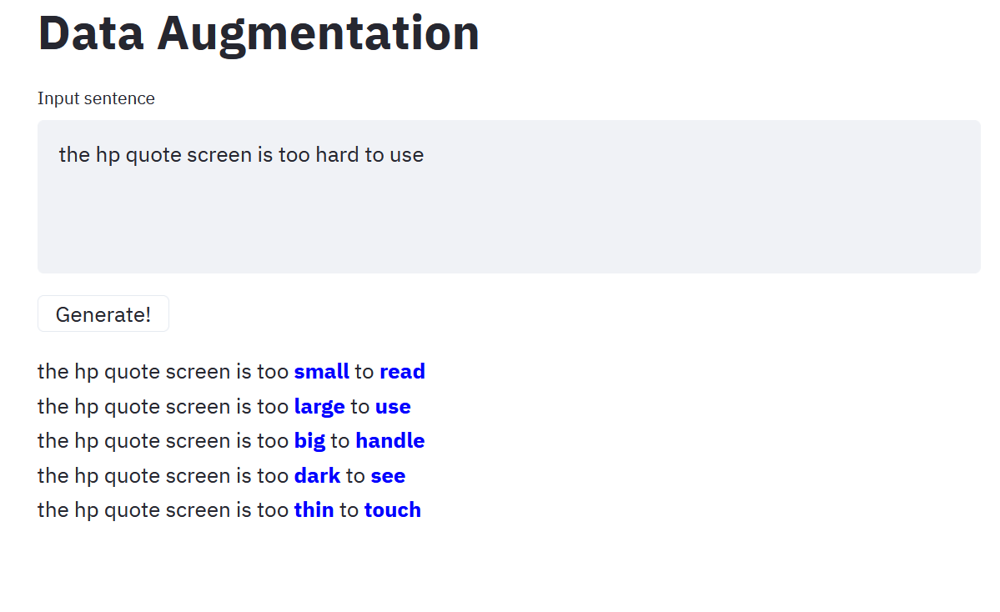
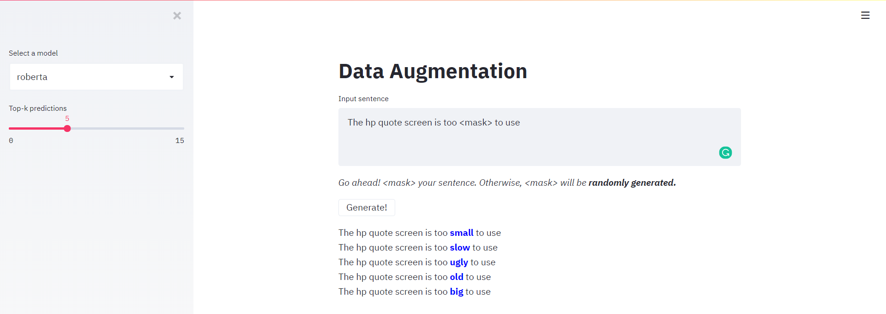
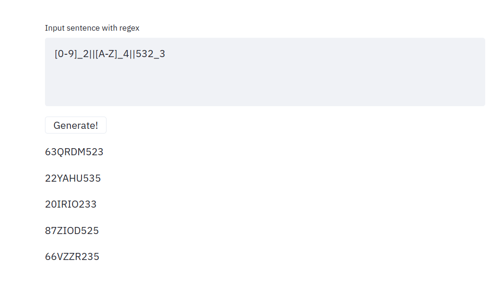
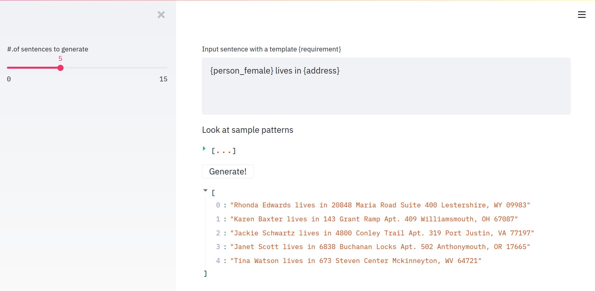

# augmentation_apps

## 1. Vanilla Predictions using LMs
A basic application to check the language models' prediction. Supports `roberta`, `bert`, `bart`, `electra`, `xlmroberta`.

### Usage 

`pip install streamlit`

`streamlit run app.py`

### Application Details

Application will `<mask>` the sentence if not `<masked>`

Updated UI.


## 2. Regex to words

`Instructions to run:`

```
streamlit run regex2word.py
```


`Usage for user:` 
* Specify each sub-pattern separated by "||".
* For each sub-pattern, specify the [0-9]/[a-z]/[A-Z]/[aA-zZ] and mention the num of chars to generate but separate these two by "_".


Example: `[0-9]_2||[A-Z]_4||532_3`
means 
1. Generate __2__ digits
2. Generate __4__ capital letters
3. Generate __3__ letters only using 5,3,2



## 3. Faker lib to generate fake data given a template sentence

`Instructions to run:`

```
streamlit run fakerapp.py
```


`Usage for user:` 
* Specify what you want to be faked by `{requirement}`.
* Currently, it can fake `'country', 'person_male', 'person_female' ,'address', 'city', 'company', 'country_code','language_name'`.


Example: "`{person_female}` lives in the `{country}`"
means 
1. Generate random female name
2. Generate random country name.
3. Generate synthetic sentences with those combinations.



## Grammar Module
_Work in Progress..._
## Class Transfer
_Work in Progress..._